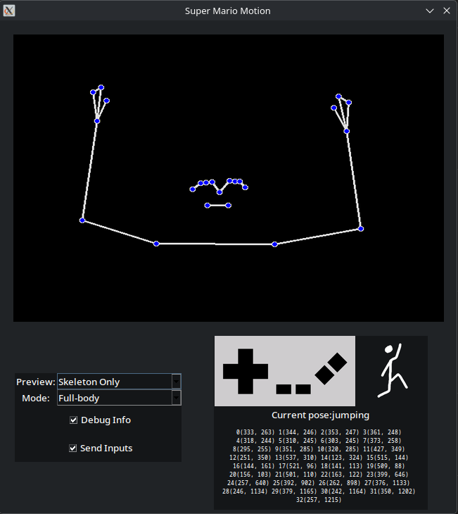

# Super Mario Motion 
  [](https://github.com/Sascha37/super-mario-motion/actions/workflows/run_test.yml)


An application written in Python that uses OpenCV alongside MediaPipe to translate your movements,
captured by your webcam, into inputs for *Super Mario Bros. 1*.

This software is designed to be used alongside an NES emulator running the original Super Mario
Bros. game.
We do not provide the emulator or the game.

If you don't have an emulator, the application also supports sending inputs to a web version of the game.

## Table of Contents

- [Requirements](#requirements)
- [Downloads](#downloads)
- [Build app and edit source code](#build-app-and-edit-source-code)
    - [On macOS and Linux](#on-macos-and-linux-using-make)
    - [On Windows](#on-windows)
- [Usage](#usage)
- [Project Documentation](#project-documentation)
- [Compatibility](#compatibility)
- [Data Processing](#data-processing)
- [Contributing](#contributing)
- [License](#license)

## Requirements
### For running the app
- **Webcam:** Any common USB webcam will do, make sure it is connected, otherwise, the program will
  not be able to run

- (Optional) **NES Emulator**: Any of your choice.
  - **Recommended:** default
  settings [Steam version of RetroArch](https://store.steampowered.com/app/1118310/RetroArch/) using the preinstalled FCEUmm NES core
- (Optional) **ROM file**: You must provide your own legally obtained NES ROM. This repository does not
  include or link to any ROMs.

### For building the app

- **Python**: Version 3.12.10 / 3.12.11

- **External libraries**: All required modules can be found in
  the [requirements.txt](https://github.com/Sascha37/super-mario-motion/blob/main/requirements.txt)
  file

## Downloads
Get the latest release of this application here:

https://github.com/Sascha37/super-mario-motion/releases/latest


## Build app and edit source code

### On macOS and Linux (using `make`)

If you want to start working on the app, use:

```
git clone https://github.com/Sascha37/super-mario-motion.git
cd super-mario-motion/
make run
```

- `make run`  starts the application
- `make pyinstaller` will build an executable (for the current os)
- `make train` builds the ML model (needs training data)
- `make test` will run the pytest testsuite
- `make doc` creates the sphinx html docs page
- `make metrics` runs tests on the current joblib to get metrics

To modify the source code, open the project in your preferred text editor or IDE.

Alternatively to using the makefile, you can manually create a Python virtual environment and
install dependencies using pip. Look into
the [Makefile](https://github.com/Sascha37/super-mario-motion/blob/main/Makefile) of this project
for reference.

### On Windows (without PyCharm)

If you just want to **run** the program, execute the `run-win.bat` file, located in the root folder of the project.

You can edit the source code in any IDE you like.

### On Windows (with PyCharm)
If you want to **work with and modify this code**, we recommend the code editor
[PyCharm](https://www.jetbrains.com/pycharm/)

There are a few steps to set up this project inside the IDE.

1. Make sure you have the correct version of the Python interpreter installed (3.12.10 or 3.12.11)
2. PyCharm will prompt you to create a virtual environment and install the dependencies listed in `requirements.txt`. Do that.
3. Now you need to set up the run configurations. Do that by clicking on the top right where it says `Current File`. And select `edit configurations`. A new window will pop up. There, you will add a new configuration by pressing the `+`-Button. You need to select `Python`. You can give it a name like `main`, make sure that you select `module` from the drop-down menu and set the path as `super_mario_motion.main`.
4. Right-click the `src` folder and select: `Mark Directory as` -> `Sources Root`.

## Usage

### Quick Start

- Start the program (either from source code or the standalone application).
- Select the version of the game you want to play (web or original).
- Select between `Simple` (designed to be used while sitting) or `Full-body` mode (designed to be used while standing). 
- Inputs can only be sent to the game if the window of the game is in focus and the `Send Inputs` checkbox has been checked.

**For more information please press the `Help`-Button or [open this file](https://github.com/Sascha37/super-mario-motion/blob/main/docs/help/help_page.pdf)**

<p align="center">
    
</p>

## Project Documentation

- Everything related to documentation can be found in the `docs/` folder.
    - For PDFs used as bullet points to discuss in the weekly meetings, see `docs/meetings/`
    - A comprehensive report, including weekly feature updates, can be found
      in [progress_documentation.md](https://github.com/Sascha37/super-mario-motion/blob/main/docs/progress_documentation.md)

## Compatibility

This project is being developed and tested on the following operating systems:

- **Windows 10** (22H2) and **Windows 11** (25H2)
- **macOS** (15.7.1 and 26.1)
- **Arch Linux** using Wayland and KDE Plasma

We aim to support all versions of Windows, macOS, and Linux.

If you encounter issues on any version, please leave an issue so we can investigate.

## Data Processing

Uses the webcam input of your selected camera to estimate your body pose in real time.
No webcam images or videos are saved.

[Look at this flowchart for more information](docs/smm_flowchart.md)

### Collecting training data
When collect mode is enabled, pose data will be recorded for training.
- Stored data consists of:
  -  pose labels
  -  list of skeleton landmark coordinates
- Data each run is saved as a CSV file to your Application Data Directory

### Model Training
Searches for all CSV files in your Application Data Directory, concatenates them into a single file. This file is then used to produce a single `.joblib` model file.

## Contributing
If you want to contribute to the project, please take a look at [CONTRIBUTING.md](CONTRIBUTING.md)
## License

This project is available under the GPL v3.0. See
the [LICENSE](https://github.com/Sascha37/super-mario-motion/blob/main/LICENSE) file for more info.