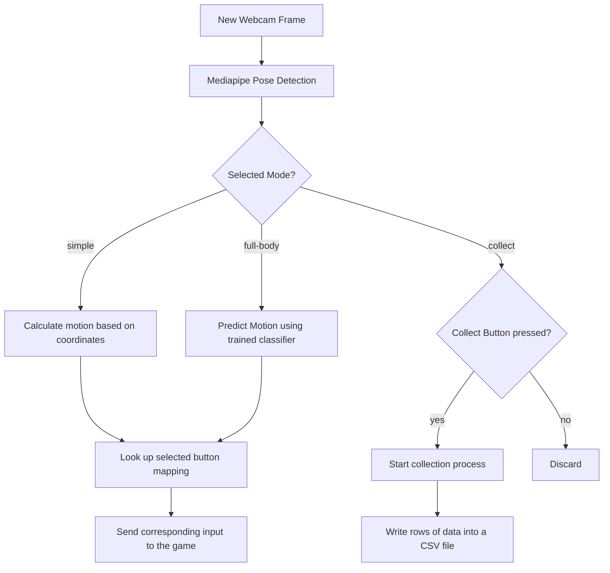

```mermaid
flowchart TD
    Frame[New Webcam Frame]
    Frame --> Mediapipe[Mediapipe Pose Detection]

    Mediapipe --> Mode{Selected Mode?}
    Mode -- simple --> Simple[Calculate motion based on coordinates] --> Input
    Mode -- "full-body" --> Fullbody[Predict Motion using trained classifier] --> Input
    Mode -- "collect" --> CButton{Collect Button pressed?}
    CButton -- "yes" --> CProcess[Start collection process]
    CProcess --> Save[Write rows of data into a CSV file]

    CButton -- "no" --> Discard

    Input[Look up selected button mapping] --> Input2[Send corresponding input to the game]
``` 